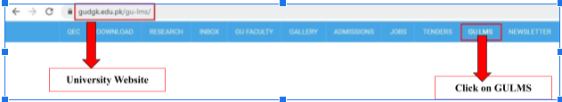
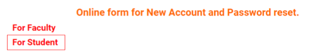
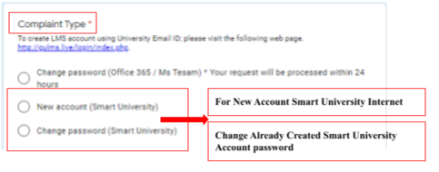

# How to apply for Ghazi Samrt Univerisity/Eduroam Account

**Step 1:** Click the link below

[https://www.gudgk.edu.pk/gu-lms/](https://www.gudgk.edu.pk/gu-lms/)

**Step 2:** Click on **“For Student”**  to open the ‘student’s form’

**Step 3:** In “Complaint Type” option.  If your want to create new account then click on **“New Account  (Smart University)”** if you already have an account then click on **“Change Password (Smart University)”**

**Step 4:** After submission of form you will receive **“EDUROAM”** login details on your university email (<example@student.gudgk.edu.pk>).

**Note:** Please use university email address to access the above mentioned online form
