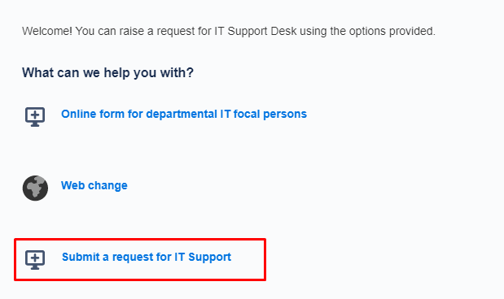
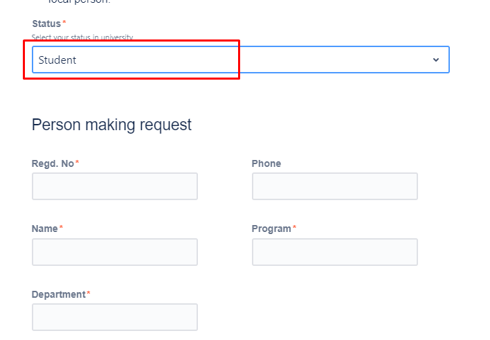
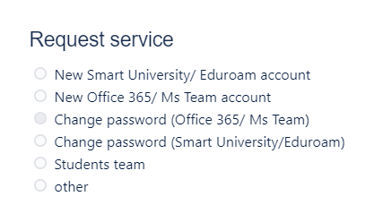
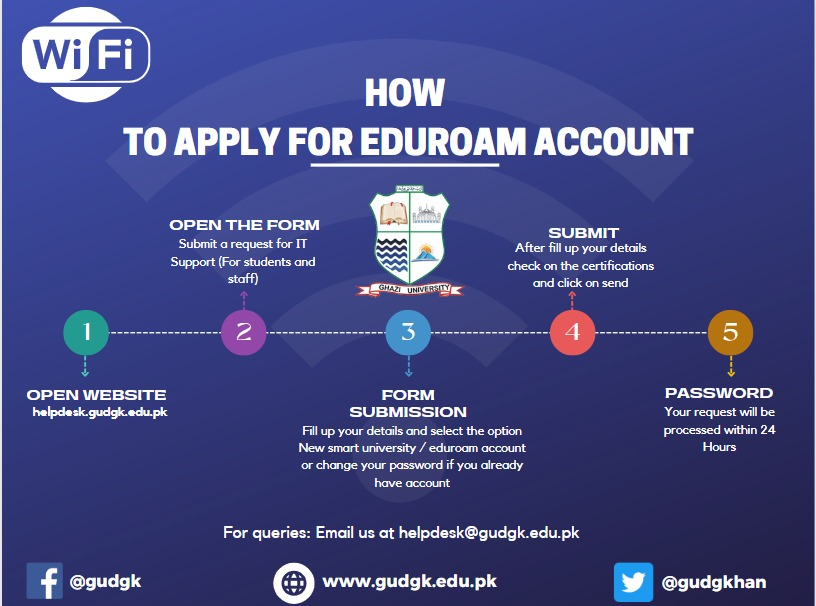

# How to apply for Ghazi Samrt Univerisity/Eduroam Account

[Download]([apply-eduroam.pdf])

**Step 1:** Open <https://helpdesk.gudgk.edu.pk/>

**Step 2:** Select **Submit a request for IT Support**

**Step 3** Enter the **Summary** of your request

**Step 4:** Select **Status** and fill in personal details

**Step 5:** Select the **New Smart University/ Eduroam account**

**Step 6:** Click **Send** button

**Note:** Please use university email address to access the above mentioned online form
