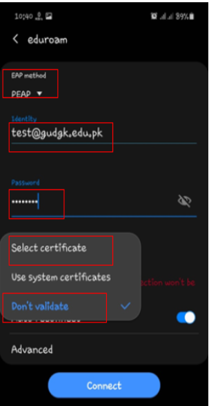
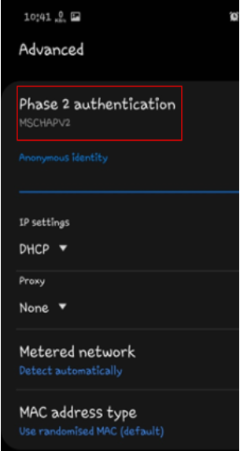
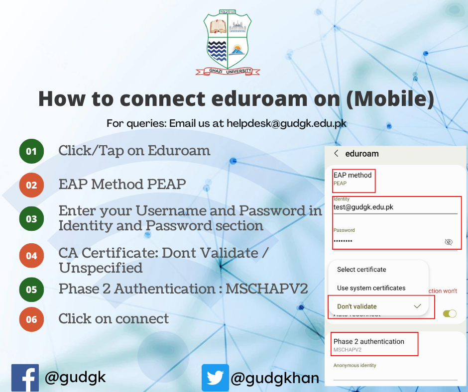

# Connecting to The Smart University Wireless Network using Andriod

[Download](config-android.pdf)

**Step 1:** click and connect to **eduroam**

**Step 2:** Change EAP method to **PEAP** and select CA certificate to **don’t validate**

**Step 3:** Enter your Smart University Login Credentials in identity box  **(Username)** and **password** in password box.

**Step 4:** in advance option select **MSCHAPV2** in phase 2 authentication option

**Step 5:** Tap **Connect**

