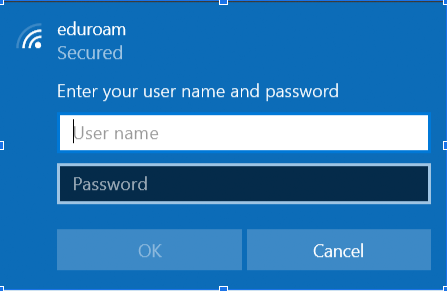
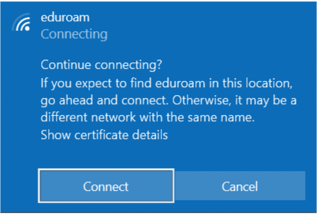
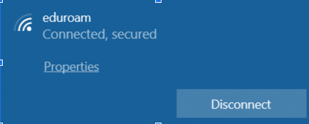

# Connecting to The Smart University Wireless Network using Windows 10

**Step 1:** Select the icon to access the internet from the task bar in the lower-right. You will see an icon that
will look like one of the images below.

**Step 2:** Select **eduroam** from the list of available Networks and select **Connect**.

**Step 3:** Enter Your user name and password

**Step 4:** Then click on **connect**.

**Step 5:** If successfully authenticated the status will change to Connected (may briefly display Limited).
You will now be connected to the “Ghazi Smart University” service.

- Your credentials should now be stored and you will only be prompted again when your password is
changed.
