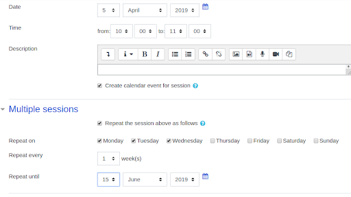

# Adding sessions to an attendance activity

**Step 1:** In the Attendance activity, click the **Add Session tab**.

**Step 2-:** Select the **Date** for the first session you want to add.

**Step 3:** Select the **start** and **end Time** of the session.

> The time fields use a 24-hour clock, so a 3:15pm-4:05pm class should be entered as 15:15-16:05.

**Step 4:** Enter a short Description for the session. If you leave the description field blank, the description will default to Regular class session.

**Step 5:** For multiple, regularly repeating sessions:

1. Check the **Repeat** the session above as follows box.

2. Check the **weekday(s)** the class Repeats on.

3. Change the Repeat every 1 weeks menu if necessary.
  
4. Set the Repeat until date to the date of the final session.

**Step 6:** Scroll down and click **Add button**. The Sessions tab will display with a confirmation message and the newly created session(s).

