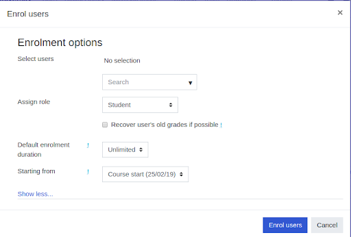
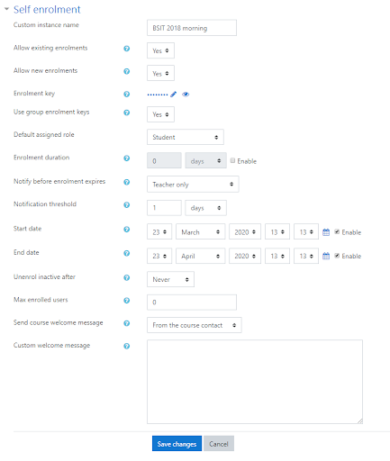

# LMS - Enroll Students

**Step 1:** Go to **'More'** from the gear menu in the nav drawer Participants link

**Step 2:** **Course administration > Users > Enrolled user** in the Administration block

**Step 3:** Click the **Enrol users** button at the top right or bottom left of the page.

**Step 4:** Use the **Assign roles** dropdown if you wish to change the role.

**Step 5:** Click to expand the enrolment options and set them as appropriate. These include the enrolment duration

**Step 6:** Browse or search for the user (Note that when searching for users, exact matches are listed first)

**Step 7:** Click the **Enrol users” button**

## Further reading

- [Manual enrolment](https://docs.moodle.org/38/en/Manual_enrolment)

- [Video Tutorial: How can I add teachers and learners to my courses?](https://www.youtube.com/watch?v=PdQjI9i9N5s)

- [Video tutorial: Self enrolment settings](https://youtu.be/WQNSs_sAUiY)

- [Self enrolment](https://docs.moodle.org/38/en/Self_enrolment)

