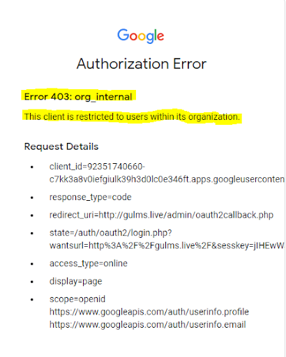

# LMS - Frequently Asked Questions

## 1. How to enroll in course

- Please contact your subject teacher for enrollment in the course.

There are two main methods for enrollment in courses.

**Manual enrollment**

The manual enrolments method allows students to be enrolled manually in the course by the subject teacher. 

**Self enrollment**

Self enrolment is the method whereby students can choose to enrol themselves into a course, either immediately by clicking "enrol me in this course" or by typing in an enrolment key they have been given. The enrollment key will be provided by the subject teacher.

## 2. Authentication error during LMS website login

- This error occurs because of using a personal email id to login on LMS. To avoid this error, Please change your web browser or reopen the same web browser and use university email id and password to login on LMS. (Only following university domains email addresses are allowed abc@student.gudgk.edu.pk, abc@gudgk.edu.pk)

- signout your personal account from web browser.

