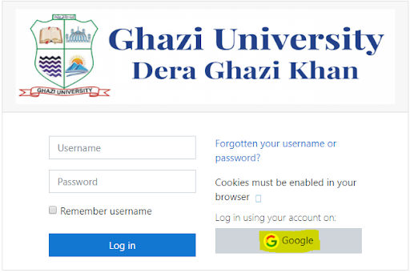

# How to Integrate Google Sign-In into University LMS 

**Note:** visit <http://gmail.com/> to activate your university email id provided by the IT department.

**Step 1:** Go to  <http://gulms.live/>

**Step 2:** Click the **“Login In”** on the right panel

**Step 3:** Click on **“Google”** button

Click on **“Google”** button

**Step 4:** Fill in the Username and Password.  (university email id and password)
User name example:

- <username@gudgk.edu.pk> (for faculty members)
- <username@student.gudgk.edu.pk> (for students)

**Step 5:** Open your **“University email account”** and click on the link to activate your account and verify your email address. 
