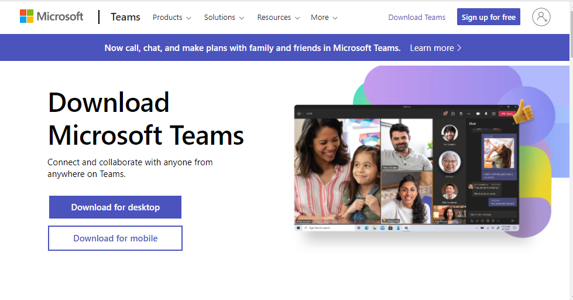
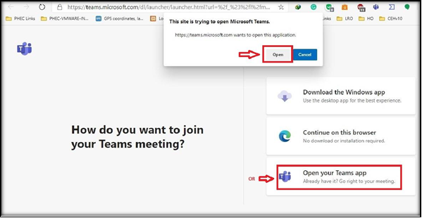
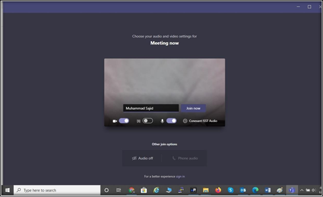
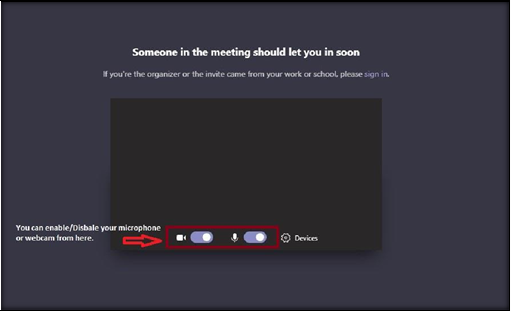
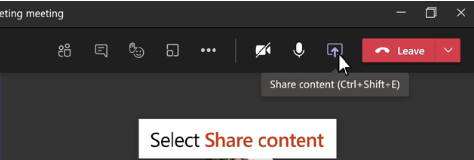

# Presenter Microsoft Teams User Guide

## Online Meeting Requirement

- Laptop, Computer System or Smartphone

- If you have a laptop then most laptops have a webcam, microphone and built-in speakers. If you have all in working condition, then hopefully there will be no issue you will face.

- For desktop/Tower Computer System you need headphones with microphone working condition and a webcam connected to the system.  It is recommended to install MS Teams Application before joining a meeting.

- For Smartphone, Download the MS team App from the store to join the meeting.

- Good Internet Connection

## Download Microsoft Teams on Laptop/Desktop.

[https://www.microsoft.com/en-ww/microsoft-teams/download-app](https://www.microsoft.com/en-ww/microsoft-teams/download-app)

## Join a Teams meeting on the web

Don't have the Teams app? You can still join a Teams meeting.

**Step 1:** In your email invite, select or click on the meeting join link

**Step 2:** You have three choices:

- **Download the Windows app:** Download the Teams desktop app.
- **Continue on this browser:** Join a Teams meeting on the web.
- **Open your Teams app:** If you already have the Teams app, go right to your meeting.

**Step 3:** Click on continue with browser, if MS Team application is not installed.

**Step 4:** Type your name.

**Step 5:** Choose your audio and video settings.

**Step 6:** Select Join now.

**Step 7:** Depending on meeting settings, you'll get in right away, or go to a lobby where someone in the meeting will admit you.

## Join a Team meeting on the Mobile

**Step 1:** If you are using a smartphone, first of all, Download MS Team on the Smartphone.

- [Download the MS Team app (Andriod Users)](https://play.google.com/store/apps/details?id=com.microsoft.teams&hl=en&gl=US)
- [Download the MS Team app (IOS Users)](https://apps.apple.com/us/app/microsoft-teams/id1113153706)
  
**Step 2:** Click on Meeting URL shared with you in email.

**Step 3:** **You must enter your name** here.Then Click on **Join** Now button.

## Show your screen during a meeting (Presenter)

In Microsoft Teams, you can show your desktop, a specific app, presentation, or any file while in a meeting.

**Step 1:** Select Share

**Step 2:** Select what you want to share:

- **Desktop** lets you show everything on your screen
- **Window** lets you show a specific app.
- **PowerPoint** lets you show a presentation.
- **Browse** lets you find the file you want to show.
  
**Step 3:** After you select what you want to show, a red border surrounds what you're sharing.

**Step 4:** Select **Stop sharing** to stop showing your screen.

## Further reading

- ### [Join a Teams meeting](https://support.microsoft.com/en-us/office/join-a-teams-meeting-078e9868-f1aa-4414-8bb9-ee88e9236ee4)

- ### [Join a meeting without a Teams account](https://support.microsoft.com/en-us/office/join-a-meeting-without-a-teams-account-c6efc38f-4e03-4e79-b28f-e65a4c039508)

- ### [Tips for Teams meetings](https://support.microsoft.com/en-us/office/tips-for-teams-meetings-23dd847d-52a6-4325-b0dd-9d8f2b29af50)

- ### [Show your screen during a meeting](https://support.microsoft.com/en-us/office/show-your-screen-during-a-meeting-90c84e5a-b6fe-4ed4-9687-5923d230d3a7)

- ### [Share Powerpoint slides in a Teams meeting](https://support.microsoft.com/en-us/office/tip-show-powerpoint-slides-in-a-meeting-ddfc73dd-b957-4f2b-8e42-ce078f51873c)

- ### [Share content in a meeting in Teams](https://support.microsoft.com/en-us/office/share-content-in-a-meeting-in-teams-fcc2bf59-aecd-4481-8f99-ce55dd836ce8)

- ### [Change your background for a Teams meeting](https://support.microsoft.com/en-us/office/change-your-background-for-a-teams-meeting-f77a2381-443a-499d-825e-509a140f4780)
