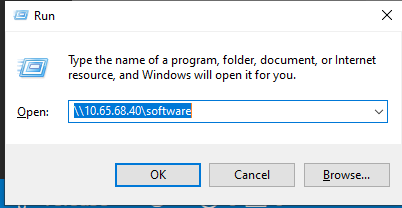
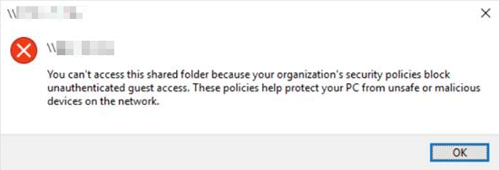

# Download Software share

## Access software share

1. Click **win+R**
2. Type **\\10.65.68.40\software**

## [Error] You can't access this shared folder because your organization's security policies block unauthenticated guest access

1. Open the **Local Group Policy Editor** (gpedit.msc).
2. In the console tree, select **Computer Configuration > Administrative Templates > Network > Lanman Workstation**.
3. For the setting, right-click **Enable insecure guest logons** and select **Edit**.
4. Select **Enabled** and select **OK**.

### Further reading

- [Can't access shared folders from File Explorer in Windows 10](https://docs.microsoft.com/en-us/troubleshoot/windows-client/networking/cannot-access-shared-folder-file-explorer)
