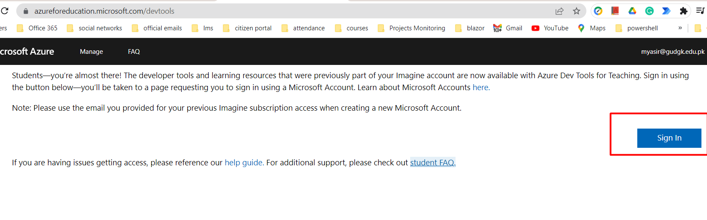
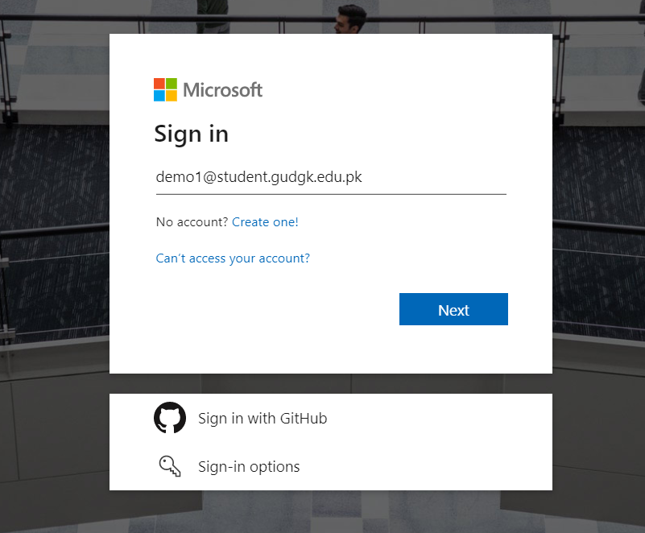
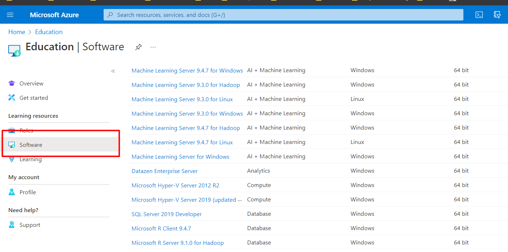

# How to Login to Azure Dev Tools for Teaching Portal

[Download](azure-dev-tools.pdf)

**Step 1:** Go to <https://azureforeducation.microsoft.com/devtools> and click the **Sign In** button.

**Step 2-:** You will be sent to a Microsoft Sign In page. Put in your GU e-mail address and click Next.

**Step 3:** In the **Home/overview** page, click on the **Software** link to display a list of the software available to you.

