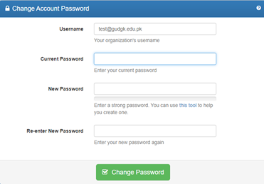

# Change Password of Office 365

- [Change Password - Self Service](https://pcp.pern.edu.pk/)
- [PERN Self Password Reset](https://prp.pern.edu.pk/)

## How to Change or Reset Your Account Password

**Step 1:** Open [https://pcp.pern.edu.pk/](https://pcp.pern.edu.pk/)

**Step 2:** Enter data in form 

- Username (your official email)
- Current Password
- New Password 
- Confirm New Password

 
